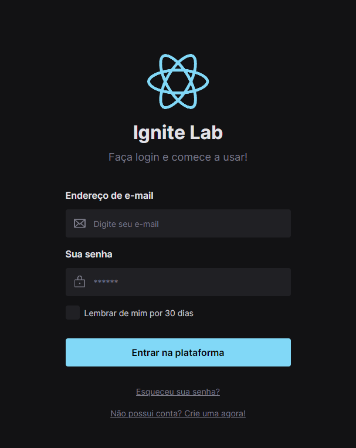
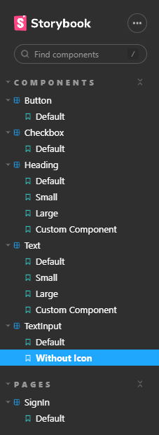

<h1 align="center"> Ignite Lab  </h1>

Evento exclusivo e gratuito promovido pela Rocketseat para ensino sobre o desenvolvimento de um Design System e sua componentização.

  <a href="#-tecnologias">Tecnologias</a>&nbsp;&nbsp;&nbsp;|&nbsp;&nbsp;&nbsp;
  <a href="#-projeto">Projeto</a>&nbsp;&nbsp;&nbsp;|&nbsp;&nbsp;&nbsp;
  <a href="#-layout">Layout</a>&nbsp;&nbsp;&nbsp;|&nbsp;&nbsp;&nbsp;
  <a href="#memo-licença">Licença</a>

 
  
  
  
  

 

  
  

## 🚀 Tecnologias

Esse projeto foi desenvolvido com as seguintes tecnologias:

- [Figma](https://www.figma.com)
- [React](https://pt-br.reactjs.org)
- [Storybook](https://storybook.js.org)
- [TailwindCSS](https://tailwindcss.com)
- [Typescript](https://www.typescriptlang.org)
- [Vite](https://vitejs.dev/)

## 💻 Projeto

O projeto desenvolvido teve como objetivo iniciar a construção de um Design System no Figma. Em seguida partimos para o código desenvolvendo os componentes desenhados no Storybook, através do React e Typescript, e utilizando o TailwindCSS para estilização

## 🔖 Layout

Você pode visualizar os componentes disponíveis no Storybook através [DESTE LINK](https://elenmagalhaes.github.io/react-design-system/) e também acessar o Design System no Figma por [ESTE LINK](https://www.figma.com/file/Wi8ZDQKlDkIM9TqIkTyKxk/Ignite-Lab-Design-System).

## :memo: Licença

Esse projeto está sob a licença MIT.  

---

Desenvolvido por Elen Magalhães
